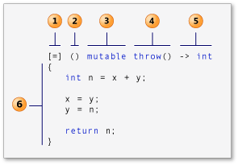

C++ is not just C with classes, it is a very powerful language that comes with many features that are provided by languages like Python and JavaScript.

In this article, I have shown a few features that you may know from Python or JavaScript that you can use in C++ too!!

> This article is for people with a basic understanding of C++

## Table of Content

- [Templates](#templates)
- [Auto](#auto)
- [Variable Argument Function](#variable-argument-functions)
- [Standard Template Library](#standard-template-library)
- [Range Based For Loop](#range-based-for-loop)
- [Lambda Expressions](#lambda-expressions)

## Templates

Suppose you want to write a function with the same operations on different data types. 

This is straightforward in Python as the same variable can *point* to different objects of different types. So you can reuse the same code for all types.

Now, in C++ one solution is to overload the function with different types but that will require you to write a lot of code that basically does the same thing. Here comes the use of **templates**. 

Instead of writing functions with different types yourself, you can have the compiler generate them for you by using templates. The compiler knows which functions to generate based on the *parameter* provided.

Let's see an example:

- A template function for getting the maximum of two values, the value can be of any data type.

  ```cpp
  #include <iostream>
  
  template <typename type>	// Creating a template
  type max(type first, type second)
  {
      return first > second ? first : second;
  }
  
  int main()
  {
      std::cout << max<int>(2, 3) << "\n";			// 3
      std::cout << max(3.4f, 4.2f) << "\n";	// 4.2
      std::cout << max('C', 'S') << "\n";		// S
  
      return 0;
  }
  ```

  - The first call will tell the compiler to create a function with `type` replaced by `int`
  - Similarly, the second and third calls will create a function with `type` replaced by `float` and `char`.
  - In the first call we have explicitly told the compiler that type is `int` with `<type>` notation. 

> You can similarly create templates for classes.
>
> To learn more about templates in C++, checkout this [article](https://docs.microsoft.com/en-us/cpp/cpp/templates-cpp?view=vs-2019#default-template-arguments)


## Auto

You can deduce the type of a variable at compile time using the `auto` keyword.

This is useful when a variable has a complicated type.

Here is an example of `auto`

```cpp
#include <iostream>
#include <string>

int main()
{
    auto an_int = 50;
    auto a_float = 10.5f;
    auto a_double = 100.12;
    auto a_char = 'S';
    auto a_string = "String";

    std::cout << an_int << "\n";		// 50
    std::cout << a_float << "\n";		// 10.5
    std::cout << a_double << "\n";		// 100.12
    std::cout << a_char << "\n";		// S
    std::cout << a_string << "\n";		// String

    return 0;
}
```

> To learn more about auto in C++, read this [article](https://docs.microsoft.com/en-us/cpp/cpp/auto-cpp?view=vs-2019)


## Variable Argument Functions

If you know Python then you must have used `*` for creating a function with a variable number of arguments.

You can do the same in C++ using Ellipsis and variadic templates.

Let us understand this with an example -

```cpp
#include <iostream>

template <typename type>
int sum(type n)
{
    return n;
}

template <typename first, typename... types>	// Packing Arguments
int sum(first n, types ...args)		// Expanding Arguments
{
    return n + sum(args...);	
}

int main()
{
    int sum3 = sum(1,2,3);
    std::cout << sum3 << "\n";		// 6
    int sum5 = sum(1,2,3,4,5);
    std::cout << sum5 << "\n";		// 15

    return 0;
}
```

Here, `...` after `typename` is packing all the arguments passed when calling into `types`, and then we are unpacking them again with `...` before `args`. 

Then we have used recursion to call a function with arguments one less than the original.

**Similarly you can create a print function that takes any number of arguments** - 

```cpp
#include <iostream>

template <typename First>
void print(First first)
{
    std::cout << first << "\n";
}

template <typename First, typename ... Types>
void print(First first, Types ... args)
{
    std::cout << first << " ";
    print(args...);
}

int main()
{
    print("One", "Two");
    print("One", "Two", "Three", "Four");

    return 0;
}
```

> Learn more about ellipsis and variadic templates in this [article](https://docs.microsoft.com/en-us/cpp/cpp/ellipses-and-variadic-templates?view=vs-2019)


## Standard Template Library

In C++, only a few primitive data types are available inbuilt, unlike Python which provides a dynamic list, dictionary, set and tuples, etc.

Standard template library(STL) is a software library for C++, which provides these kinds of data structures and algorithms.

STL provides the following four components:

- *Algorithms*: searching, sorting, etc.
- *Containers*: Sequences such as vector, list. Queue, stack, map, set, etc.
- *Functions*
- *Iterators*

It is called a template library because it uses the C++ template feature discussed above.

Let's see one example of a container: vector.

#### Vector

The STL `vector` class is a class template for sequence containers.

It stores elements of a given type in a linear order and allows fast random access to any element. Sounds like an array? Yes, it is an array but it is dynamic means its size can change when needed.

This example shows how to create and use a vector:

```cpp
#include <iostream>
#include <vector>	// STL Header file for vector class

int main()
{
    std::vector<int> numbers{1, 2, 3, 4, 5};

    for (int i = 0; i < numbers.size(); i++)
        std::cout << numbers[i] << " ";
    std::cout << "\n";  // OUTPUT: 1 2 3 4 5

    std::vector<char> alphabets;	// Empty vector
    alphabets.push_back('a');	// adding an element to back of vector
    alphabets.push_back('b');
    alphabets.push_back('c');

    std::cout << alphabets[1] << "\n";  // OUTPUT: b

    return 0;
}
```

> To learn more about STL, checkout this [article](https://docs.microsoft.com/en-us/cpp/standard-library/cpp-standard-library-overview?view=vs-2019)


## Range Based For Loop

In the previous example, we used a simple for loop to iterate over our vector. We can do the same with the better *range-based for loop*. 

**Syntax**:

```pseudocode
for (for-range-declaration : expression)
    statement
```

So this is how we can change the previous code with a range based for loop:

```cpp
// For printing the numbers vector
for (int x : numbers)
    std::cout << x << " ";

// For printing the alphabets vector
for (auto ch : alphabets)	// Notice the use of auto - Recommended
	std::cout << ch << " ";

// With arrays
for (auto i : {1, 2, 3})
        std::cout << i << " ";	// 1 2 3

int arr[] = {4, 5, 6};
for (auto j : arr)
    std::cout << j << " ";	// 4 5 6
```

Here `x` will point to an individual element in `numbers` one by one.

> To learn more about range-based loops, read this [article](https://docs.microsoft.com/en-us/cpp/cpp/range-based-for-statement-cpp?view=vs-2019)


## Lambda Expressions

A lambda expression is a convenient way of defining an anonymous function.

Lambdas are used to encapsulate a few lines of code that are passed to algorithms and other functions.

**Syntax**:



1. *capture clause*: Specifies which variables are **captured** from the surrounding scope and whether the capture is by value or by reference.

   - Variables prefixed with & are accessed by reference other by value.

   - Empty clause `[ ]` indicates that the lambda body has no access to variables in enclosing scope.
   - `[&]` means all variables are captured by reference.
   - `[=]` means all variables are captured by value.

2. *parameter list* (optional): A lambda can accept input parameters just like a normal function. It is optional and you can leave the parenthesis empty in case of no parameters.

1. *mutable specification* (optional): `mutable` keyword allows us to modify a value captured in the lambda body. (Usage is shown in the example below).
2. *exception-specification* (optional): You can use the `noexcept` exception specification to indicate that the lambda expression does not throw any exceptions.
3. *trailing-return-type* (optional): Just like normal function a lambda also have a return type. You can omit the return-type part of a lambda expression if the lambda body contains just one return statement or the expression does not return a value.
4. *lambda body*: A lambda body can contain anything that a normal function's body can contain.

These are a few examples of lambda functions:

- Here we have used a lambda function that finds the square of a number. The type of the lambda is automatically deduced using auto and it is stored in an identifier `square`.

  The return type is automatically deduced to `int`.

  ```cpp
  #include <iostream>
  
  int main()
  {
      auto square = [](int n) {
        return n * n;  
      };
  
      std::cout << "Square of 2 = " << square(2) << "\n";
      // Square of 2 = 4
  
      return 0;
  }
  ```

- Here, we have shown the usage of the `mutable`  keyword, without using it we would have received an error saying `outer` is read-only.

  Moreover, the value of the `outer` is unchanged outside lambda as it was captured by value `[=]`.

  ```cpp
  #include <iostream>
  
  int main()
  {
      int outer = 50;
  
      auto fn = [=]() mutable {
          outer = 100;    // OK, because of mutable
          std::cout << "Outer = " << outer << "\n";   // Outer = 100
      };
  
      fn();
      std::cout << "Outer = " << outer << "\n";   // Outer = 50
  
      return 0;
  }
  ```

- Here, we have used lambda to pass a function to the for_each algorithm.

  ```cpp
  #include <iostream>
  #include <algorithm>
  #include <vector>
  
  int main()
  {
      std::vector<int> nums{1, 2, 3, 4, 5, 6};
  
      for (auto x : nums) // 1 2 3 4 5 6 
          std::cout << x << " ";
      std::cout << "\n";
  
      // Square every number
      std::for_each(begin(nums), end(nums), [](int& n) {n = n * n;}); 
  
      for (auto x : nums) // 1 4 9 16 25 36 
          std::cout << x << " ";
      std::cout << "\n";
  
      return 0;
  }
  ```

> To learn more about lambda functions, checkout this [article]([https://docs.microsoft.com/en-us/cpp/cpp/lambda-expressions-in-cpp?view=vs-2019#:~:text=In%20C%2B%2B11%20and,an%20argument%20to%20a%20function.](https://docs.microsoft.com/en-us/cpp/cpp/lambda-expressions-in-cpp?view=vs-2019#:~:text=In C%2B%2B11 and,an argument to a function.))


## EndNote

This article was only supposed to *introduce* you to some modern powerful features provided by the C++ language.

If you want to learn more about these features, you may check out the links provided for each topic.

C++ has more amazing and modern features contrary to the belief that it is an old and outdated language.

**Share your opinion in the comments**.

### Thanks For Reading


---


#### You may also like:

- [How to Create Header Files in C++](https://blog.yuvv.xyz/how-to-create-header-files-in-cpp)

- [What Happens When You Run a Computer Program?](https://blog.yuvv.xyz/what-happens-when-you-run-a-computer-program)
- [Comprehensions in Python: Explained](https://blog.yuvv.xyz/comprehensions-in-python-explained)
- [Linux Commands Reference With Examples](https://blog.yuvv.xyz/linux-commands-reference-with-examples)